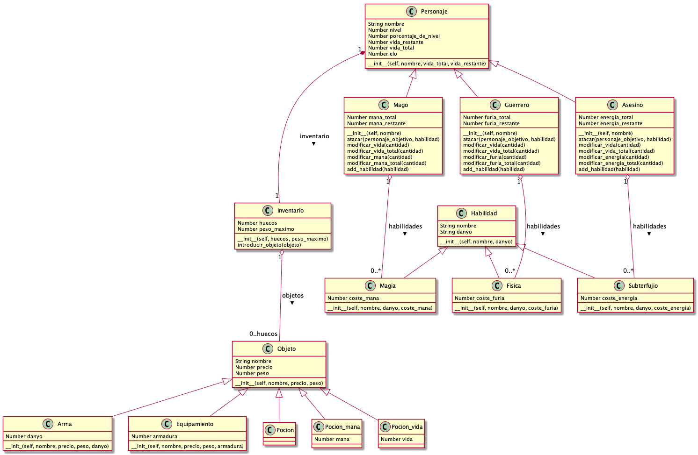

# Al-Ándalus Programación y Computación 2 - Alan-game

## Hacer funcionar test

Para que los test funcionen hay que lanzar la siguiente orden con la clase que se va a testear y el test en la misma carpeta.

```sh
python -m unittest -v personaje_test.py
```
A los alumnos les proporcionaremos los test y el diagrama de clases. A parte y como es lógico, estaremos encima para ayudarles.

## Modelo a implementar

Meto un diagrama UML para tenerlo como referencia para implementar, pongo una versión preliminar.

Como no sabemos cual es el ritmo que seguirá la clase hemos implementado un amplio diagrama de clases. Proponemos primero centrarnos en el lado de personajes y todo lo relacionado con ellos menos el inventario.



Dependiendo del ritmo desarrollaran también la parte de inventario y todo lo relacionado con ello.

## Propuesta de división de grupos.

Pretendemos dividir la clase en 3 grupos en los que cada grupo se encargará de un arquetipo de personaje junto con las habilidades de ese arquetipo. Por ejemplo, la clase Guerrero y las habilidades Físicas.

## Extras por si no está el entorno instalado

### Intalación y cosas que hacer primero

Lo ideal es que una vez tengais instalado Python3 y Pip3 instales virtualenv, porque sino todas las dependencias que instalemos con pip se instalan de manera global y eso no esta bien, por lo que te dejo las ordenes para instalar y usar virtualenv :P

### Que hacer si estás con Ubuntu

```sh
sudo apt-get install python3-pip
sudo pip3 install virtualenv 

virtualenv venv #Asi se crea por primera vez el virtualenv, en este caso se llama venv, pero le puedes llamar como te de la gana.
```

Veras que cuando ejecutas la orden se te crea una varpeta llamada venv, todas las dependencias se trasladarán hay, para entrar y salir en el virtualenv tienes que usar estas ordenes

```sh
source venv/bin/activate #Esto para activarlo estando dentro de la carpeta principal del proyecto

deactivate #Para salir del venv y volver a tu terminal normal :P
```

Todo esto seria igual en windows excepto que para activar el entorno virtual lanzariamos la siguiente orden.

```sh
venv/Scripts/activate #Esto para activarlo estando dentro de la carpeta principal del proyecto

deactivate #Para salir del venv y volver a tu terminal normal :P
```
